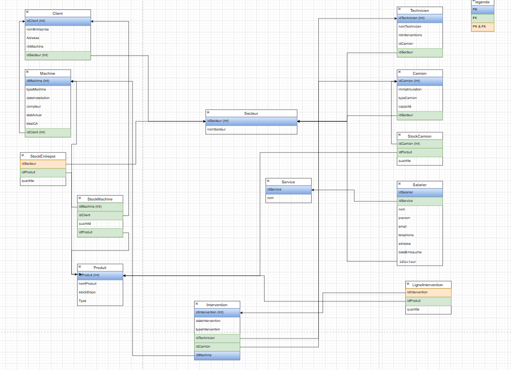
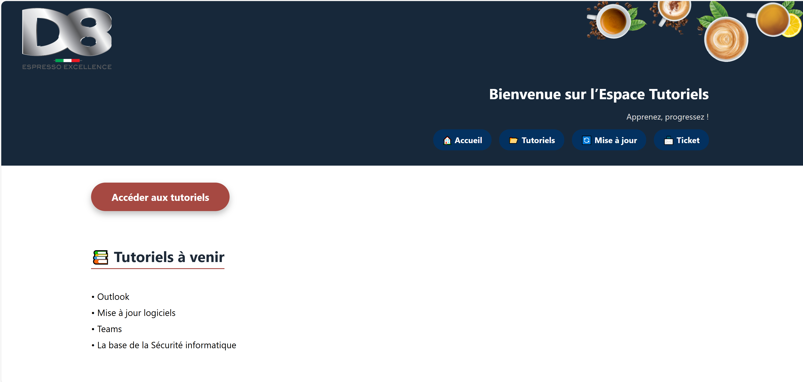

Title: Stage SIO1

> **<u>FICHE DESCRIPTIVE :</u>**

> <u>**Dates du stage :**</u>
>
> - **Date début :** 19/05/2025
> - **Date fin :** 27/06/2025
>
> **Entreprise :** D8 s.a.s

# Présentation de l'entreprise : 

### D8 S.A.S — Distributeur automatique de boissons & solutions café

- **Fondée en 1973**, D8 est une PME française (SAS) implantée à **Vitry-sur-Seine (94)**, avec des agences régionales à **Jargeau (45)** et **Saint-Maximin (60)**.
- Spécialisée dans la **vente, location et gestion de distributeurs automatiques** pour entreprises et établissements publics (boissons chaudes, snacks, fontaines à eau, café torréfié, etc.), D8 propose des services **sur-mesure**, incluant installation, réassort, entretien et assistance technique.
- Forte de plus de **200 collaborateurs**, l’entreprise réalise un **chiffre d’affaires de plus de 26 millions d’euros** (2022) avec une équipe dédiée à la **proximité, la réactivité et la qualité de service**.
- Reconnue pour ses **solutions conviviales et professionnelles**, D8 met l’accent sur le bien-être au travail via des pauses café attractives, générant des échanges sociaux, du confort et une meilleure productivité en entreprise.

# Missions & tâches réalisés : 

## Semaine 1

### Jour 1
La matinée a débuté par une présentation générale de l’entreprise, son organisation ainsi que ses différents pôles d’activité. J’ai ensuite été affecté à un poste informatique, configuré pour mes travaux à venir.

Dans un second temps, j’ai pris en main l’outil Draw.io, une application en ligne permettant de concevoir des schémas de bases de données. J’ai commencé par une première ébauche simplifiée de la base de données de l’entreprise afin de me familiariser avec sa structure globale, sans entrer dans les détails techniques.

<!--  -->

L’après-midi, j’ai approfondi cette modélisation en représentant une partie réelle de la base de données de l’entreprise, incluant le nom des différentes tables et champs. Ce travail m’a permis de mieux comprendre la logique de structuration des données dans l’entreprise.  
J’ai également été introduit à Vega, un logiciel de gestion interne.

**Points positifs relevés lors de cette première approche :**
- Une base de données simplifiée avec moins de tables
- Des relations claires entre les tables
- Une nomenclature cohérente, du type nomtable_donnéeChamp, facilitant la lisibilité

### Jour 2
La matinée a été consacrée à l’installation de Oracle SQL Developer sur mon poste. Ce logiciel m’a permis d’effectuer des requêtes SQL directement sur une base de données test de l’entreprise, ce qui m’a aidé à me familiariser avec les données réelles.

### Jours 3 à 5
J’ai approfondi l’utilisation de Vega, en explorant ses différentes tables et champs. Cela m’a permis de mieux comprendre son fonctionnement, notamment dans l’optique de produire des statistiques ou d’extraire des données pertinentes via SQL.

Durant ces journées, j’ai également commencé à traiter différents problèmes concrets, comme :
- La configuration d’onglets spécifiques sur Microsoft Teams pour certains membres de l’équipe
- L’ajustement de l’affichage d’informations sur les écrans internes de l’établissement

J’ai aussi réalisé plusieurs requêtes SQL (rassemblées dans le fichier requeteSql) pour analyser des données métiers et renforcer mes compétences en manipulation de bases Oracle.

---

## Semaine 2

### Jour 1
Matinée : installation d’une VM Linux comme serveur afin de pouvoir accueillir une page web pour l’entreprise.

Après-midi : recherche de Template et début du code de la page.

### Jour 2
Durant cette journée, j'ai continué les travaux entamés la veille en consolidant l'infrastructure web mise en place sur la machine virtuelle Linux. J’ai également débuté la conception d’une page web dédiée aux tutoriels de l’entreprise. Cette page a pour objectif de regrouper des ressources formatives destinées aux collaborateurs.

En parallèle, j’ai réalisé plusieurs requêtes SQL avancées sur la base de données de test de l’entreprise. Ces requêtes visaient à extraire des statistiques utiles, telles que :
- Le nombre de factures générées sur une période donnée
- La liste des clients disposant de machines avec les options les plus récentes
- Une analyse de la répartition des produits ou services par client

Cela m’a permis d’améliorer ma maîtrise du langage SQL dans un environnement Oracle.

### Jour 3
Journée principalement consacrée au développement web. J’ai poursuivi la création de l’interface utilisateur de la page tutoriels, avec un accent mis sur l’ergonomie et le design responsive. Cela a impliqué :
- L’intégration dynamique d’un en-tête commun (header.html) pour faciliter la maintenance du site
- L’utilisation de feuilles de style CSS personnalisées
- La structuration des différentes sections de la page, telles que le bouton d’accès aux tutoriels et la liste des tutoriels à venir

Voici un aperçu de la page d’accueil de la page web, qui a été retravaillée pour un environnement plus professionnel :

---

**Lien vers mon profil GitHub :**  
[Mon GitHub (victorgms3)](https://github.com/victorgms3)

## Projet D8

Pendant la 4ᵉ et la 5ᵉ semaine de mon stage, j'ai pu mettre en place un
outil qui n'existait pas encore, mais qui est désormais très utile à
l'entreprise.

**Explication :**
D8 dispose d'opérateurs chargés de ravitailler les distributeurs
automatiques (D.A). Chaque opérateur a une tournée quotidienne définie
par les coordinateurs. Ces derniers gèrent quelles D.A doivent être
ravitaillées et quand. Cependant, il arrive que certaines D.A ne soient
pas ravitaillées à temps, ce qui génère des retards. Jusqu'à présent,
ces retards étaient simplement comptabilisés en nombre de jours, avec un
suivi jusqu'à +1 jour de retard.

Le problème était qu'il n'y avait pas de distinction entre une D.A
retardée d'un seul jour et une D.A retardée plusieurs fois (plus de 2
jours au total). Pour y remédier, j'ai développé un outil permettant aux
coordinateurs de visualiser directement, sur une page dédiée, les D.A en
retard de plus de 2 jours. Cela leur permet d'agir plus efficacement sur
les retards répétitifs.

**Outils utilisés et étapes du développement**

Dans un premier temps, j'ai utilisé **SQL Developer** pour rédiger une
requête SQL adaptée afin d'obtenir les résultats souhaités. Ce travail a
demandé beaucoup de rigueur et de temps : il fallait non seulement
écrire la requête, mais aussi vérifier la validité des données
retournées, tester les différents cas, et ajuster les calculs.

Une fois la requête fonctionnelle et conforme aux besoins, j'ai dû
l'adapter pour qu'elle soit compatible avec le **système de reporting
interne de VEGA**.
Ce système permet de générer automatiquement des rapports à partir de
requêtes SQL, directement intégrés dans les outils de suivi utilisés par
les coordinateurs. Cependant, ce système a certaines contraintes
techniques :

-   Il **n'accepte pas les CTE** (*Common Table Expressions*),
    c'est-à-dire les instructions de type WITH \... AS (\...) souvent
    utilisées pour rendre les requêtes plus lisibles. J'ai donc dû
    réécrire la requête de manière linéaire.
-   Il **ne supporte pas les points-virgules ;** à la fin des requêtes.
-   Il **n'interprète pas certaines fonctions comme TO_DATE()** ou les
    formats de date complexes.
-   Enfin, il impose une structure stricte pour la sélection et
    l'affichage des données dans les rapports.

Une fois ces adaptations techniques réalisées, j'ai pu passer à l'étape
de la **mise en page du reporting**, avec l'aide de mes responsables. En
effet, l'interface de configuration des rapports dans VEGA n'est pas
très intuitive, et nécessite une bonne connaissance de l'outil pour
obtenir un affichage clair et exploitable.

**[🔗 Rapport PDF : Retards de réapprovisionnement](../../files/ProjetD8_retardReappro.pdf)**